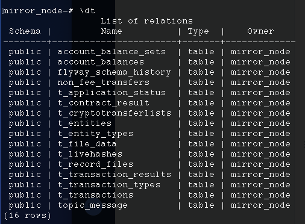

# Mirror Nodes

## Hedera Testnet Mirror Node

The Hedera Consensus Service \(HCS\) gRPC API is a public mirror node managed by Hedera for the testnet. It offers the ability to subscribe to HCS topics and receive messages for the topic subscribed. API docs for the mirror nodes can be found here:


**HCS Testnet Mirror Node Endpoints:**  
hcs.testnet.mirrornode.hedera.com:5600 

**REST API Testnet Root Endpoint:**  
[https://testnet.mirrornode.hedera.com](https://testnet.mirrornode.hedera.com/)




## Community Mirror Nodes

If you don't have access to a Hedera testnet mirror node, you can check out the community hosted mirror node services for your testnet development below.

⚪[Dragon Glass](https://app.dragonglass.me/hedera/home)

⚪[Kabuto](https://kabuto.sh)

## Run Your Own Beta Mirror Node

### Overview

A Beta Mirror Node is a node that receives pre-constructed files from the Hedera testnet. These pre-constructed files include **transaction records** and **account balance files**. Transaction records include information about a transaction like the transaction ID, transaction hash, account, etc. The account balance files give you a snashot of the balances for all accounts at a given timestamp.

 In this tutorial, you will run your own Beta Mirror Node. You will need to create a Google Cloud Platform account if you do not have one already. The Beta Mirror Node object storage bucket, where you will pull the account balance and transaction data from, is stored in Google Cloud bucket and is configured for [requester pays](https://cloud.google.com/storage/docs/requester-pays). This means the Beta Mirror Node operator is responsible for the operational costs of reading and retrieving data from the Google Cloud bucket. A Google Cloud Platform account will provide the necessary information to cover the costs of the requests and download of the data. 

### Requirements

* [Google Cloud Platform Account](https://cloud.google.com/)
  * Create a [project](https://cloud.google.com/resource-manager/docs/creating-managing-projects) and link your [billing account](https://cloud.google.com/billing/docs/how-to/manage-billing-account)
  * Get your [accessKey](https://cloud.google.com/storage/docs/authentication/managing-hmackeys), [secretKey](https://cloud.google.com/storage/docs/authentication/managing-hmackeys), and [project ID](https://cloud.google.com/resource-manager/docs/creating-managing-projects)
* [Docker](https://www.docker.com/get-docker)
  * Check to see if you have it installed from your terminal: `docker --version && docker-compose --version`
* [Git](https://git-scm.com/book/en/v2/Getting-Started-Installing-Git)
* [Hedera Mirror Node Repository](https://github.com/hashgraph/hedera-mirror-node) 
  * You will be prompted to download the repo in the following steps 

### 1. Obtain Google Cloud Platform Requester Pay Information

You will need to grab the **secret key, access key**, and **project ID** from your Googe Cloud Platform account

* From the left navigation bar select **STORAGE &gt; SETTINGS**
* Click on the **Interoperability** tab and scroll down to the **User account HMAC** section
* Set your default project
* Click **create keys** to generate access keys for your account


* You should see the **access key** and **secret** columns populate on the table
* You will use these keys to populate the **application.yml** configuration file in a later step

### 2. Clone Hedera Mirror Node Repository

* Open your terminal
* Download the hedera-mirror-node repository 

```text
git clone https://github.com/hashgraph/hedera-mirror-node
```

* CD to the hedera-mirror-node folder

```text
cd hedera-mirror-node
```

### 3. Configure your application.yml file

* Open the **application.yml** file found in the root directory with a text editor of your choice 
* Input the following information and uncomment each line

| Item | Description |
| :--- | :--- |
| **accessKey** | Your accessKey from your Google Cloud Platform account |
| **bucketName** | The name of the bucket you would like to grab the data from |
| **cloudProvider** | GCP |
| **secretKey** | Your secretKey from your Google Cloud Platform account |
| **gcpProjectId** | Your Google Cloud Platform project ID |



```text
hedera:
  mirror:
    importer:
      downloader:
        accessKey: GOOG....
        bucketName: hedera-stable-testnet-streams
        cloudProvider: "GCP"
        secretKey: h+....
        gcpProjectId:
      network: TESTNET
```



### 4. Start Your Beta Mirror Node

* From the hedera-mirror-node directory, run the following command:

```text
docker-compose up
```

* Upon sucessfully running your Beta Mirror Node, you will see two folders created in the hedera-mirror-node directory titled **data** and **db**
* The **data** folder contains the information downloaded from the google cloud bucket including account balances and records streams

### 5. Access Your Beta Mirror Node Data

To access the mirror node data now available to you, enter the `hedera-mirror-node_db_1` container.

* Open a new terminal
* To view the `hedera-mirror-node_db_1` container ID, enter the following command:

```text
docker ps
```

* Enter the following command to enter the docker container

```text
docker exec -it <containerId> bash
```

* Enter the following command to access the database

```text
psql "dbname=mirror_node host=localhost user=mirror_node password=mirror_node_pass port=5432"
```

* Enter the following command to view the complete list of tables

```text
\ls
```



### 

